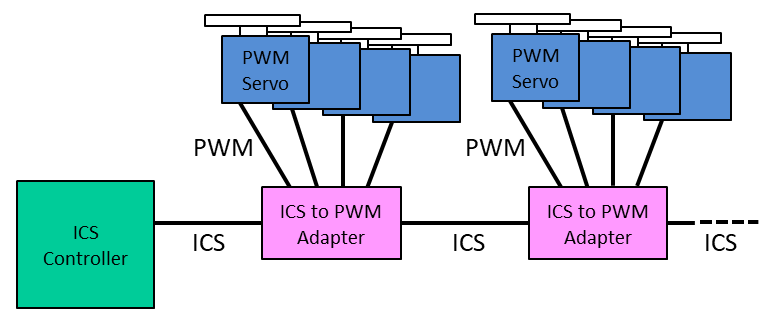
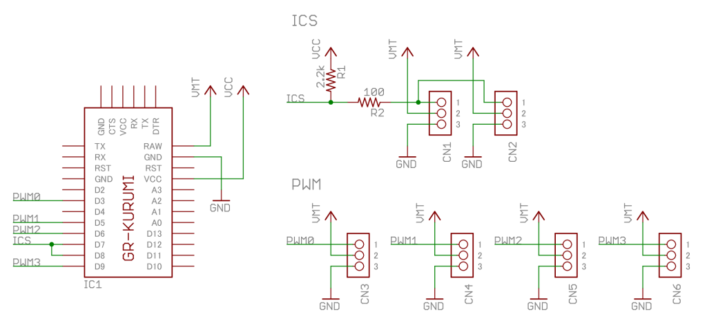
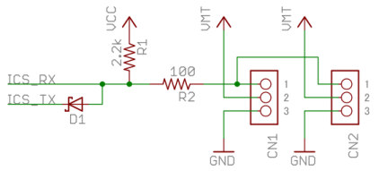

# ICS bus to PWM servo Adapter

This adapter let you connect PWM servos to KONDO ICS serial servo bus.

A adapter can controls up to 4 PWM servos.

## Supported commands

This adapter supports a subset of ICS commands. The supported commands are **Set Position** and **Read / Write ID**. Other commands are ignored. In addition, the response value of **Set Position** command is just a dummy data. You can never get position, current or temperature from PWM servos.

See the following URL for the details of ICS commands.

https://kondo-robot.com/faq/ics3-5_3-6softwaremanual_2

### (1) Set Position
The parameter of **Set Position** is interpreted as the following.

| Value         | Operation    |
|:--------------|:-------------|
| 0             | Disables PWM output. |
| 500 to 2500   | Executes `Servo::writeMicroseconds()`. |
| 3500 to 11500 | ICS compatible position mode. Converts (3500 - 11500) to (544 - 2400), and executes `Servo::writeMicroseconds()`. |

### (2) Read / Write ID

The ID of a adapter must be a multiples of 4, and the adapter has 4 offset IDs (+0 to +3).

For example, consider the adapter which ID is 8. The ID of servos connected to this addapter are 8, 9, 10 and 11.

## Hardware
The hardware of this adapter is made of GR-KURUMI. GR-KURUMI is a kind of Aduino-based MCU board (Renesas RL78/G13).

You can also select another Arduino-based MCU board such as Arduino Pro Mini. However, most of Arduino-based MCU boards don't support open drain output of serial port. In that case, insert a diode between TxD and RxD.

## Software

The software of this adapter is Arduino based.

- [IcsPwm](IcsPwm/) : The schetch of this adapter. It is for GR-KURUMI.
- [IcsPwmTest1](IcsPwmTest1/) : A test code of ICS controller. It is for GR-ROSE.
- [IcsPwmTest2](IcsPwmTest2/) : Another test code of ICS controller. It is also for GR-ROSE.

`HardwareSerial::begin()` of GR-KURUMI is buggy. The following is a temporary bug fixed sources. The official bug fixed update is coming soon.

- [Temporary bug fix](temp/)

## Configure

[IcsPwm/config.h](IcsPwm/config.h) configures hardware settings.

| Macro | Description | Default Value|
|:--------------|:-------------|:-------------|
| `DEBUG_SERIAL` | Serial port for debug | `Serial` |
| `ICS_SERIAL` | Serial port for ICS bus | `Serial1` |
| `PIN_ICS_TX` | TX pin of `ICS_SERIAL` | `7` |
| `ICS_BAUD` | Baud rate for ICS bus | `115200` |
| `SERVO_NUM` | Maximum number of servos | `4` |
| `PIN_SERVO_0` - `PIN_SERVO_7` | PWM output pins | `3`, `5`, `6`, `9`| 

## Movie

